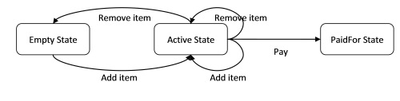
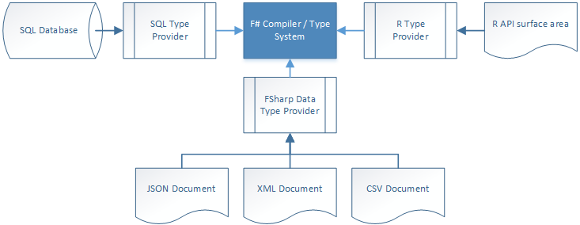

- title : Introduction to F#
- description : Introduction to F# and few interesting examples
- author : Dmitry Batalov
- theme : night
- transition : default

***

# Inroduction to F#

***

# Agenda

* What?
* Why?
* How?

***

# What is F#?

 A **strongly-typed**, **functional-first** programming language for writing **simple code to solve complex problems**.

---

## Business perspective

The primary role of F# is to **reduce the time-to-deployment** for analytical software components in the modern enterprise.

---

## Programming perspective

The most recent versions of F# greatly simplify data-rich programming through the addition of the F# type provider mechanism, F# queries and a multitude of type providers for enterprise and web data standards.

*** 

# Why f#?

* Conciseness
* Convenience
* Correctness
* Concurrency
* Completeness

*** 

## Conciseness 

    // one-liners
    [1..100] |> List.sum |> printfn "sum=%d"

    // no curly braces, semicolons or parentheses
    let square x = x * x
    let sq = square 42 

    // simple types in one line
    type Person = {First:string; Last:string}

    // complex types in a few lines
    type Employee = 
    | Worker of Person
    | Manager of Employee list

    // type inference
    let jdoe = {First="John";Last="Doe"}
    let worker = Worker jdoe

---

### C# version

    class WebPageDownloader
    {
        public TResult FetchUrl<TResult>(
            string url,
            Func<string, StreamReader, TResult> callback)
        {
            var req = WebRequest.Create(url);
            using (var resp = req.GetResponse())
            {
                using (var stream = resp.GetResponseStream())
                {
                    using (var reader = new StreamReader(stream))
                    {
                        return callback(url, reader);
                    }
                }
            }
        }
    }

--- 

### F# version

    // Fetch the contents of a web page
    let fetchUrl callback url =
        let req = WebRequest.Create(Uri(url))
        use resp = req.GetResponse()
        use stream = resp.GetResponseStream()
        use reader = new IO.StreamReader(stream)
        callback reader url

***

## Convenience

    // automatic equality and comparison
    type Person = {First:string; Last:string}
    let person1 = {First="john"; Last="Doe"}
    let person2 = {First="john"; Last="Doe"}
    printfn "Equal? %A"  (person1 = person2)

    // easy IDisposable logic with "use" keyword
    use reader = new StreamReader(..)

    // easy composition of functions
    let add2times3 = (+) 2 >> (*) 3
    let result = add2times3 5

--- 

### Domain modeling

    type Suit = Club | Diamond | Spade | Heart
    type Rank = Two   | Three | Four | Five | Six |
                Seven | Eight | Nine | Ten  |
                Jack  | Queen | King | Ace
    type Card = Suit * Rank
    type Hand = Card list
    type Deck = Card list
    type Player = { Name:string; Hand:Hand}
    type Game = {Deck:Deck; Players: Player list}
    type Deal = Deck -> (Deck*Card)
    type PickupCard = (Hand*Card) -> Hand

---

### Functions as building blocks

    // building blocks
    let add2 x = x + 2
    let mult3 x = x * 3
    let square x = x * x

    // helper functions;
    let logMsg msg x = printf "%s%i" msg x; x     //without linefeed
    let logMsgN msg x = printfn "%s%i" msg x; x   //with linefeed

    let listOfFunctions = [mult3; square; add2; logMsgN "result=";]

    // compose all functions in the list into a single one
    let allFunctions = List.reduce (>>) listOfFunctions

    //test
    allFunctions 5
***

## Correctness

    // strict type checking
    printfn "print string %s" 123 //compile error

    let person1 = {First="john"; Last="Doe"}
    // all values immutable by default
    person1.First <- "new name"  //assignment error

    // never have to check for nulls
    let makeNewString str =
        //str can always be appended to safely
        let newString = str + " new!"
        newString

    // units of measure
    let distance = 10<m> + 10<ft> // error!

--- 
### Designing for correctness

    type CartItem = string    // placeholder for a more complicated type

    type EmptyState = NoItems // don't use empty list! We want to
                            // force clients to handle this as a 
                            // separate case. E.g. "you have no 
                            // items in your cart"

    type ActiveState = { UnpaidItems : CartItem list; }
    type PaidForState = { PaidItems : CartItem list; 
                        Payment : decimal}

    type Cart =
        | Empty of EmptyState
        | Active of ActiveState
        | PaidFor of PaidForState

---
### NullReference 

    // C# code
    string s1 = "abc";
    var len1 = s1.Length;

    string s2 = null;
    var len2 = s2.Length;

    // F# code
    let s1 = "abc"
    let len1 = s1.Length

    // create a string option with value None
    let s2 = Option<string>.None
    let len2 = s2.Length    // <- Compiler fails

    let s2 = Option<string>.None
    //which one is it?
    let len2 = match s2 with
    | Some s -> s.Length
    | None -> 0

---

### Units of measures

    [<Measure>] type m
    [<Measure>] type sec
    [<Measure>] type kg

    let distance = 1.0<m>
    let time = 2.0<sec>
    let speed = 2.0<m/sec>
    let acceleration = 2.0<m/sec^2>
    let force = 5.0<kg m/sec^2>

    // check conversion correctness with measures
    [<Measure>] type degC
    [<Measure>] type degF

    let convertDegCToF c = c * 1.8<degF/degC> + 32.0<degF>

    let f = convertDegCToF 0.0<degC>

***

## Concurrency

    // easy async logic with "async" keyword
    let! result = async {something}

    // easy parallelism
    Async.Parallel [ for i in 0..40 -> 
        async { return fib(i) } ]

    // message queues
    MailboxProcessor.Start(fun inbox-> async{
        let! msg = inbox.Receive()
        printfn "message is: %s" msg
        })

--- 
### Asynchronous programming

    // Fetch the contents of a web page asynchronously
    let fetchUrlAsync url =
        async {
                let req = WebRequest.Create(Uri(url))
                use! resp = req.AsyncGetResponse()  // new keyword "use!"
                use stream = resp.GetResponseStream()
                use reader = new IO.StreamReader(stream)
                let html = reader.ReadToEnd()
                printfn "finished downloading %s" url
            }

    // a list of sites to fetch
    let sites = ["http://www.bing.com"; "http://www.google.com";]

    sites
    |> List.map fetchUrlAsync  // make a list of async tasks
    |> Async.Parallel          // set up the tasks to run in parallel
    |> Async.RunSynchronously  // start them off

---

### MessageBox

    let printerAgent = MailboxProcessor.Start(fun inbox->
        // the message processing function
        let rec messageLoop() = async{

            // read a message
            let! msg = inbox.Receive()

            // process a message
            printfn "message is: %s" msg

            // loop to top
            return! messageLoop()
            }

        // start the loop
        messageLoop()
    )

    printerAgent.Post "hello"
    printerAgent.Post "hello again"

***

### Completeness

    // impure code when needed
    let mutable counter = 0

    // create C# compatible classes and interfaces
    type IEnumerator<'a> =
        abstract member Current : 'a
        abstract MoveNext : unit -> bool

    // extension methods
    type System.Int32 with
        member this.IsEven = this % 2 = 0

    let i=20
    if i.IsEven then printfn "'%i' is even" i

    // UI code
    open System.Windows.Forms
    let form = new Form(Width= 400, Height = 300,
            Visible = true,Text = "Hello World")
    form.TopMost <- true
    form.Click.Add (fun args-> printfn "clicked!")
    form.Show()

***

### TypeProvider

***

# Testemonials

---

## UK-based Power Company
##### Simon Cousins
I have now delivered three business critical projects written in F#. I am still waiting for the first bug to come in.
http://fsharp.org/testimonials/#simon-cousins-2

--- 
## Kaggle
The F# code is consistently shorter, easier to read, easier to refactor and contains far fewer bugs. As our data analysis tools have developed … we’ve become more productive.
http://fsharp.org/testimonials/

---
## Other testemonials
http://fsharp.org/testimonials/

***

### Links

* http://fsharp.org/about/index.html
* http://fsharpforfunandprofit.com/
* http://dungpa.github.io/fsharp-cheatsheet/
* https://github.com/fsprojects/awesome-fsharp#community

***

### Thank you!

